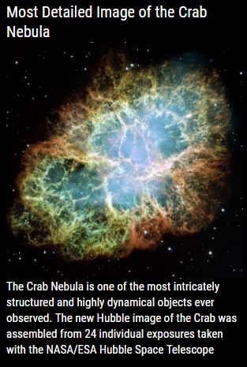
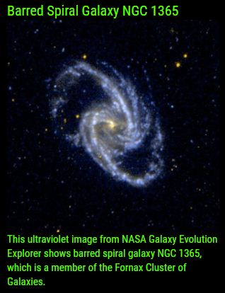
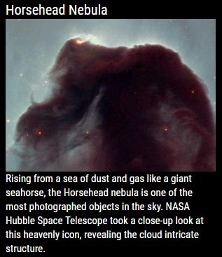
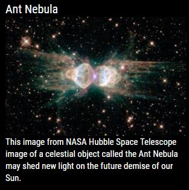
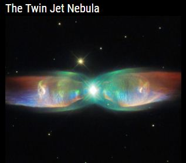
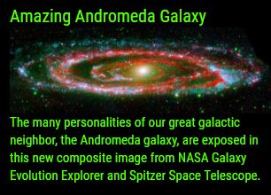

## MMM-NASA
Stunning imagery and information about your universe. Looks amazing on your mirror!

Brought to you by NASA's Hubble, Spitzer and Galaxy Evolution Explorer Telescopes. (And others)

## To Infinity And Beyond!

, ,

, ,

, ,

## Installation

* `git clone https://github.com/mykle1/MMM-NASA` into the `~/MagicMirror/modules` directory.

* No API needed!

* Annotated .css file included for sizing and coloring, text or no text.

## Config.js entry and options

    {
        module: 'MMM-NASA',
        position: 'top_left',
        config: {
		search: "Galaxy",                // See Config entries for search: (Bottom of ReadMe)
		infoLength: 400,                 // length of info (mostly for static info)
            scroll: "yes",                   // yes= scrolling info, no = static info
		rotateInterval: 5 * 60 * 1000,   // New Image Appears
		useHeader: false,
		header: "",
		maxWidth: "300px",               // For description text. Image size using css file.
		animationSpeed: 3000,            // Image fades in and out
        }
    },
	

## Config entries for search: "Galaxy",  <-- Example

* The search field is somewhat flexible. You can enter either "Galaxy" or "Galaxies".
* There is no set list, per se. Try any astronomical term. These work.

* Galaxy
* Galaxies
* Nebula
* Orion nebula
* Crab nebula
* Supernova
* Asterism
* Asteroid
* Black hole
* Comet
* Any planet name (e.g. Saturn, Jupiter, etc..)
* Constellation
* Any Constellation name (e.g. Scorpius, Pegasus, Pisces) https://starchild.gsfc.nasa.gov/docs/StarChild/questions/88constellations.html
* Culmination
* Binary Star
* Earthshine
* Eclipse
* Equinox
* Gibbous
* Meteor
* Milky Way
* Occultation
* Parallax
* Retrograde
* Solstice
* Terminator
* Transit

## Try your own. Name something in the sky and see what you get.

## Special thanks to NASA and SpaceCowboysDude
